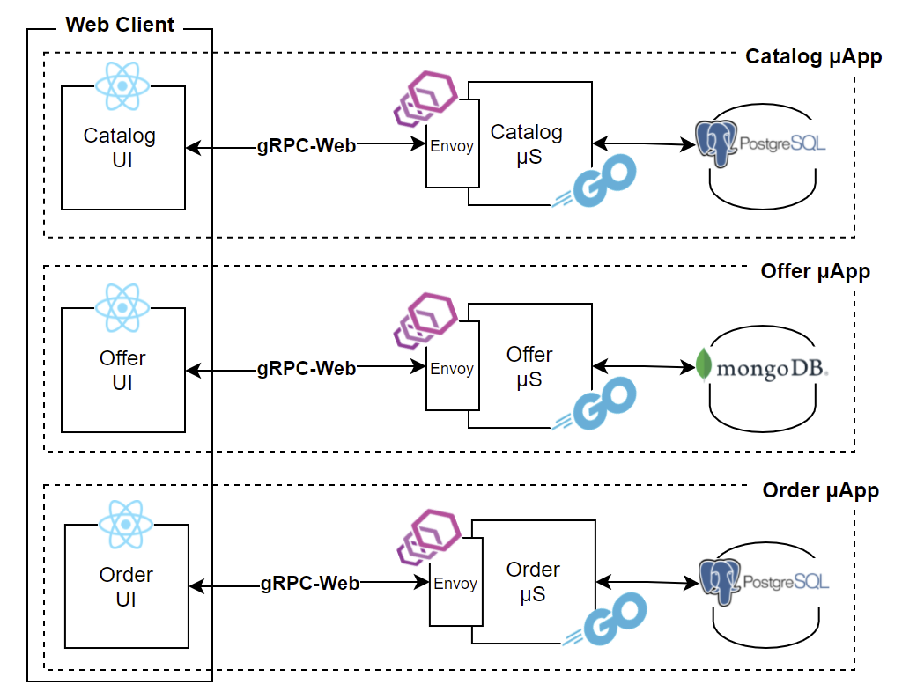
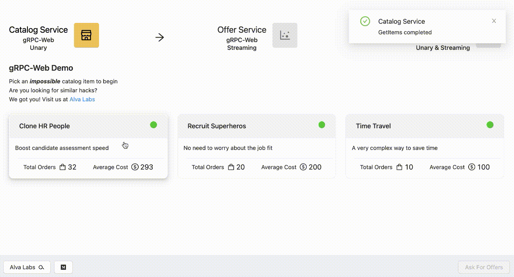

# Go final project

<p align="center"> 

</p>

This repo contains microservices written in Go (gRPC Servers) and their envoy proxy configurations for establishing connection through gRPC-Web with the client (UI). gRPC Unary and gRPC Server-side Streaming examples are available in the services.

|            | gRPC Unary | gRPC Server-side Streaming |
| :--------: | :--------: | :------------------------: |
| Catalog μS |     ✅     |                            |
|  Offer μS  |            |             ✅             |
|  Order μS  |     ✅     |             ✅             |



## Installation

Let's start!

Please make sure Docker is running.

First, clone the repository

```bash
git clone https://github.com/uid4oe/grpc-web-demo.git
```

Then, open a terminal window from the root of the project.
We will just need to create network & execute the `docker-compose` command

```bash
docker network create grpc-web-demo-alva-net
docker-compose up -d
```

At this point everything should be up and running!

You can track service logs from containers: `catalog`, `offer`, `order`.

You can access to UI at

```bash
http://localhost:3000
```

## Local Development

For running services in your local environment, we will need MongoDB, PostgreSQL, and envoy proxies (gRPC-Web related). We can use `local.yml` file for setting up MongoDB, PostgreSQL, Catalog Envoy, Offer Envoy, Order Envoy and UI.

Open a terminal in the project root folder, then;

```bash
docker network create grpc-web-demo-alva-net
docker compose --file local.yml up -d
```

Enter to this host.

```bash
http://localhost:3000
```

